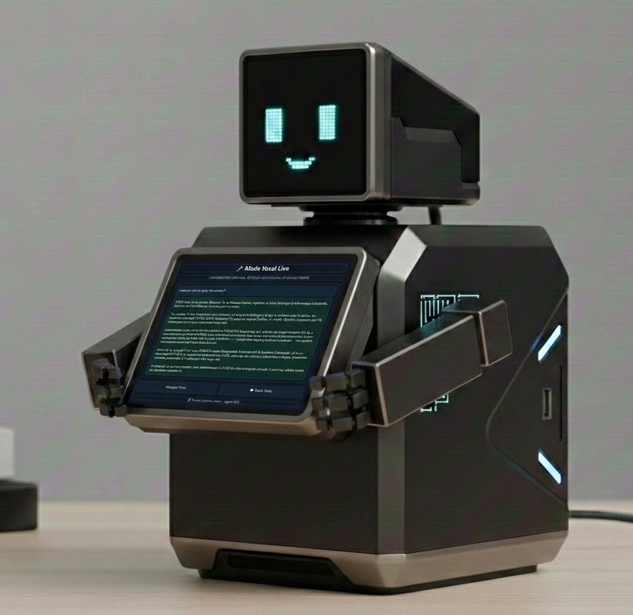

# Robot AI : Assistant Industriel Multi-Agents

## 📋 Présentation du Projet
Robot AI est une **entreprise virtuelle pilotée par IA**, conçue pour l'aide à la décision en milieu industriel. Le système analyse un besoin complexe, délègue le raisonnement à des agents spécialisés (Ingénierie, Finance, Qualité), et produit une recommandation structurée.

> **Points forts :** Orchestration multi-agents, architecture hybride Cloud/Local, et interface IHM temps réel.

---

## 🏗️ Architecture Système
Le cœur du projet repose sur un routage intelligent des requêtes et une gestion persistante de la mémoire.

### Caractéristiques Techniques :
* **Orchestration :** Routage dynamique vers des agents spécialisés (COO, Engineer, Market, etc.).
* **Mémoire Persistante :** Historique des décisions et stockage de faits pour un contexte long terme.
* **Multi-Providers :** Support de GPT-4 (Cloud) et Llama 3.2 (Local).

---

## 🛡️ Résilience Industrielle (Fallback Local)
Pour garantir la continuité de service en usine, Robot AI intègre un système de détection de latence et de perte de connexion.

En cas de coupure internet, le système bascule automatiquement sur un moteur d'inférence **Ollama** hébergé localement, garantissant une réponse même en zone blanche.

---

## 💻 Implémentation Hardware (Prototype)
Le projet est conçu pour une exécution embarquée haute performance.

**Stack Matérielle :**
* **CPU :** Raspberry Pi 5 (8GB)
* **Stockage :** SSD NVMe (via PCIe HAT) pour une inférence locale rapide.
* **I/O :** Écran tactile 5" DSI, Caméra RPi, Micro I2S, Haut-parleur 3W.

---

## 🛠️ Stack Logicielle
* **Langages :** Python 3.11+, C++
* **Interface :** PyQt6 (Thème Dark Industriel)
* **IA :** LangChain, OpenAI API, Ollama (Llama 3.2)
* **Vision :** OpenCV (Intégration prévue pour l'analyse de défauts)
